# biggan-deep-256 图片素材

由神经网络 biggan-deep-256 生成的图片

* 模型来源：[https://tfhub.dev/deepmind/biggan-deep-256/1](https://tfhub.dev/deepmind/biggan-deep-256/1)
* 使用 tensorflow 2.3 运行
* 共 1000 类，每类生成 100 张图片，以 jpg 格式储存

网页版：[https://playmat365.github.io/biggan_deep_256/](https://playmat365.github.io/biggan_deep_256/)

# 预览

点击图片可查看该分类

                           [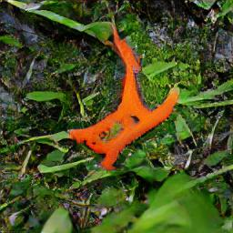](27_壁虎_eft) [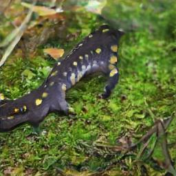](28_壁虎_spotted_salamander) [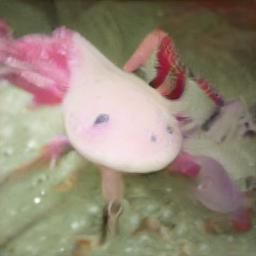](29_壁虎_axolotl)   [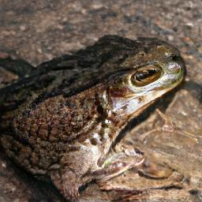](32_青蛙_tailed_frog)        [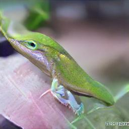](40_蜥蜴_American_chameleon)   [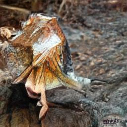](43_蜥蜴_frilled_lizard) [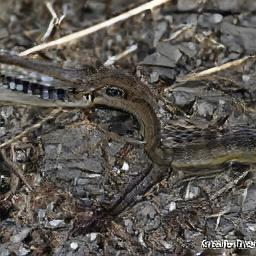](44_蜥蜴_alligator_lizard)   [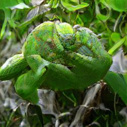](47_蜥蜴_African_chameleon)  [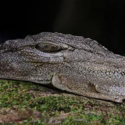](49_鳄鱼_African_crocodile)                    [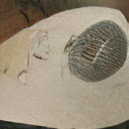](69_化石_trilobite)    [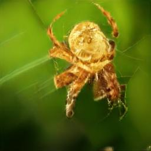](73_蜘蛛_barn_spider)   [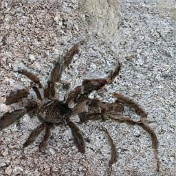](76_蜘蛛_tarantula)        [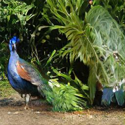](84_孔雀_peacock)                  [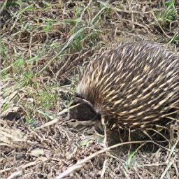](102_刺猬_echidna)  [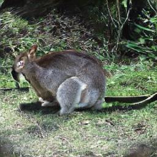](104_袋鼠_wallaby)  [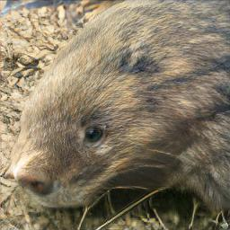](106_土拨鼠_wombat)  [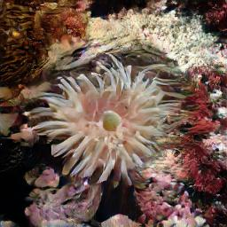](108_珊瑚_sea_anemone) [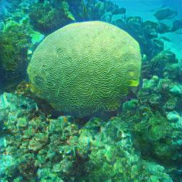](109_珊瑚_brain_coral)  [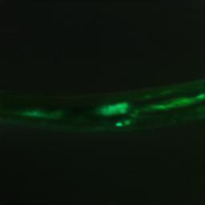](111_海蛇_nematode)  [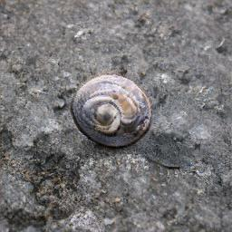](113_蜗牛_snail) [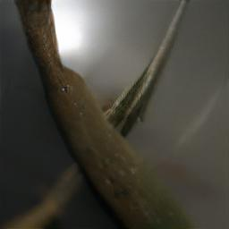](114_蜗牛_slug) [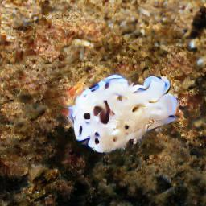](115_海洋生物_sea_slug)  [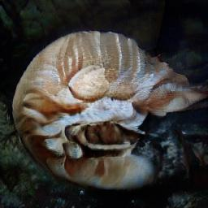](117_海螺_chambered_nautilus) [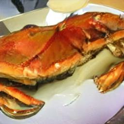](118_螃蟹_Dungeness_crab)    [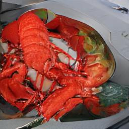](122_龙虾_American_lobster)  [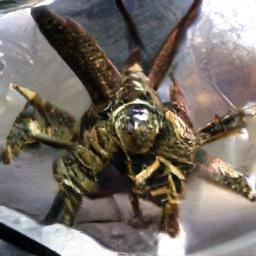](124_龙虾_crayfish)                        [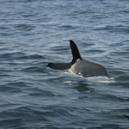](148_鲸鱼_killer_whale) [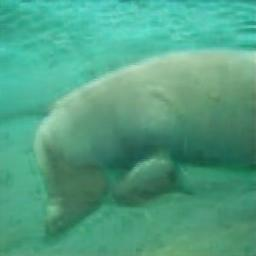](149_海象_dugong)                                                                

